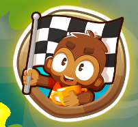
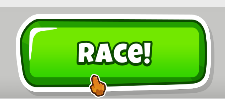
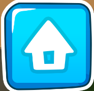

# Bloontona500-Achievement-Macro
A python keyboard/mouse macro to crank out the achievement without the tedium 

## Setup
1. Have Python installed
2. Install requirements listed [requirements.txt](requirements.txt)
3. If you are not on a 2560x1440 monitor or the race button is not third you will need to manually adjust values. 
4. Pixel and associated color values can be found in [main.py](main.py)

## Steps to run
1. Have race pass activated
2. Be on BTD6 home screen
3. run [main.py](main.py)  

## Setting Variables Manually
You can find pixel location and color using this [script](pixelpointer.py)  
You can set the variables manually to configure the macro for your system  
These variables can be found in [main.py](main.py)  
The Macro needs to know 4 locations and the colors they correspond to:  
RACE_MENU_BUTTON  
  
RACE_BUTTON (found on the newspaper popup)  
  
RACE_EVENT_POPUP (The blue area, not the button)  
  
HOME_BUTTON (In the pause menu)  
  

## Result  

